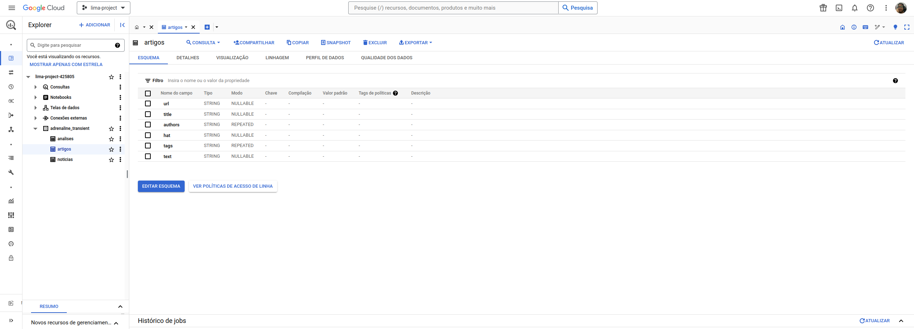
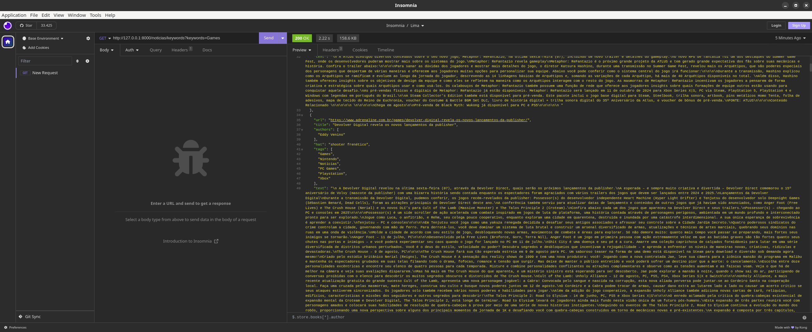

# Projeto Lima

## Desafio

Objetivo principal é **Coletar e armazenar dados de Notícias**

De forma que a solução forneça os seguintes serviços:

-   Extrai dados de um site de notícias
-   Limpa os dados
-   Armazenar os dados no BigQuery (Bônus)
-   Expõe os dados via API

### Objetivo

-   Avaliar habilidades com programação
-   Entender o nível técnico
-   Entender como ocorre o processo de design de solução

### Critérios

-   Padrão de código
-   Padrão de commits
-   Estilo
-   Solução desenvolvida
-   Uso apropriado de `source control`

### Instruções

Write an application to crawl an online news website, e.g. www.theguardian.com/au or www.bbc.com using a crawler framework such as [Scrapy] (http://scrapy.org/).
You can use a crawl framework of your choice and build the application in Python.

The appliction should cleanse the articles to obtain only information relevant to the news story, e.g. article text, author, headline, article url, etc. Use a framework such as Readability to cleanse the page of superfluous content such as advertising and html

## Execução

### Site escolhido

Após alguns testes em outras aplicações, escolhi o site da [Adrenaline] (https://www.adrenaline.com.br/) como fonte dos artigos.

_Ah, mas por quê?_ Você pode estar se perguntando. E a resposta é simples mas pode ser dividida em 3 principais motivos:

-   Organização do site
    -   O site possui uma estrutura que é favorável para a extração, com padrões de estrutura HTML bem definidos. Dados como autor, data, categorias e outras informações são simples de encontrar.
    -   O site da Adrenaline possui várias sessões de diferentes tipos de notícias, então pude fazer um `spider` pra cada tipo.
    -   `robots.txt`... Acho que essa parte foi a mais chata. O Adrenaline permite extrair dados da primeira página de notícias, o que limitou um pouco a quantidade de notícias e a profundidade em que poderia chegar com o crawler, mas como são várias sessões, acaba que não faz muita diferença no fim. Há uma quantidade considerável de artigos e isso já me deixou bem satisfeito.

### BigQuery



O BigQuery foi ativo e configurado minimamente. Para acessar o BigQuery API eu utilizei um arquivo de credencial json que não será compartilhado via GitHub, mas fiquem a vontade para me requisitar o arquivo via e-mail (**SE E APENAS SE** você for parte da equipe da Lima)

### Dificuldades

No meu dia a dia não faço uso de web scrapping no contexto em que trabalho. Então, aprender a utilizar a lib `scrapy` foi o que mais tomou meu tempo. A integração com Big Query e o servidor foram as partes menos trabalhosas do processo, mas também precisaram de bastante atenção (principalmente em relação a documentação).

A parte mais complexa foi entender a estrutura de pipeline que o Scrapy utiliza e conseguir usar de forma mais simples possível. Foi usado algumas definições de settings inplace que provavelmente podem ser feitas de outra forma.

### Lista de tarefas

-   [x] (2024/06/05 - 2024/06/06) Revisar conteúdos sobre Web Scrapping
-   [x] (2024/06/07) Criação de Spiders
    -   [x] (2024/06/07) Artigos
    -   [x] (2024/06/07) Notícias
    -   [x] (2024/06/08) Análises
    -   [x] (2024/06/08) Criação do pipeline do BigQuery
-   [x] (2024/06/08) Script para rodar as extrações
-   [x] (2024/06/08) Armazenamento no Big Query
-   [x] (2024/06/08) Leitura do Big Query
-   [x] (2024/06/08) Criação da API
-   [x] (2024/06/08) Integração do BigQuery na API

## Uso dos arquivos

### main.py

O arquivo main serve para rodar os spiders de forma programática. Sendo assim, é necessário utilizar para fazer a ingestão dos dados para o BigQuery.

Para executar o script, é necessário usar o argumento --page {página}, sendo as opções de página:

-   noticias;
-   artigos;
-   analises;

Ele irá rodar o spider referente ao que foi enviado no --page e subir os dados extraídos para o BigQuery.

Dependendo da sua máquina essa etapa pode demorar.

Optei por manter os '\n' presentes no texto pois de certa forma eles fazem parte da formatação da página, em caso de extração para leitura, muitas linguagens conseguem abstrair esses caracteres e formatar o texto.

### api.py

Aqui está localizada a API feita com FastAPI.

Esta API possui alguns endpoints para expor os dados do bigquery:

| Nome               | Método |
| ------------------ | ------ |
| /noticias          | GET    |
| /noticias/keywords | GET    |
| /analises          | GET    |
| /analises/keywords | GET    |
| /artigos           | GET    |
| /artigos/keywords  | GET    |

Os endpoints com /keywords utilizam **query parameters** para filtrar os dados.

Para definição de keywords utilizei a categoria das notícias, como por exemplo: Hardware, Games, etc.

um exemplo de requisição:

> http://127.0.0.1:8000/noticias/keywords?keywords=Hardware

```json
{
    "url": "https://www.adrenaline.com.br/games/the-first-descendant-novo-trailer-revela-data-de-lancamento/",
    "title": "The First Descendant: novo trailer revela data de lançamento",
    "authors": [
        "Eddy Venino"
    ],
    "hat": "shooter frenético",
    "tags": [
        "Games",
        "Notícias",
        "PC Games",
        "Playstation",
        "Xbox"
    ],
    "text": "\n A Nexon revelou na última sexta-feira (07) um novo trailer de The First Descendant com a data de lançamento do jogo.\nO looter shooter cooperativo será lançado gratuitamente para PC e consoles no dia 2 de julho de 2024.\nData de lançamento de The First Descendant\nDurante a transmissão da Summer Game Fest 2024, a Nexon apresentou um novo trailer de The First Descendant. Confira abaixo:\n\n\n\nO inédito trailer cinemático, criado na recém atualizada Unreal Engine 5, mostra os Descendentes indo para a luta e ficando cara a cara com novos inimigos, bem como alguns aliados. Este último trailer não apenas destaca a intensa ação e a jogabilidade cooperativa que os jogadores poderão vivenciar, mas também revela novos personagens e chefões que serão introduzidos no lançamento e em atualizações futuras.\nCom a revelação da data de lançamento em 2 de julho de 2024, a Nexon está preparando mais detalhes a serem revelados, incluindo eventos de lançamento. Mais informações serão compartilhadas futuramente antes do lançamento.\n\nDepois da conclusão da Open Beta cross-play em setembro de 2023, o produtor Lee Beomjun e o diretor Minseok Joo têm compartilhado regularmente atualizações de desenvolvimento por meio de Dev Talks e Dev Notes, incluindo melhorias e mecânicas aguardadas, como maior variedade de missões, aprimoramentos na interface de usuário e otimização gráfica.\nSobre The First Descendant\nThe First Descendant é um looter shooter na terceira pessoa, multiplataforma e de próxima geração, desenvolvido no Unreal Engine 5. Os jogadores assumem o papel de Descendente e lutam contra invasores para salvar a humanidade.\nCada Descendente possui um conceito e estilo de combate únicos e você pode fazer parte de várias missões, tanto a solo, como em co-op com até 4 jogadores – você pode fazer raides contra chefões gigantes, jogar em equipe com diversos gadgets e destruir parcialmente cada chefão.\nThe First Descendant estará disponível gratuitamente em 2 de julho de 2024 para PC via Steam, PlayStation 4, PlayStation 5,  Xbox One e Xbox Series X|S.\nFONTE: Nexon\n\n\n\nConteúdo Relacionado \n\n\n\n\n \n\n\n\n\nPacote completo\n\nNew World: Aeternum marca a estreia do MMO nos consoles\n\n\n\n\n "
},
```



## Reader

Reader é uma classe que é utilizada pela API para fazer a leitura dos dados do BigQuery. Não há uso manual para ela, ela apenas é o que é e faz o que faz.

## Pontos de melhoria

Sei que muita coisa pode ser melhorada, mas dentre as principais, estão:

-   Melhor uso dos paths
-   Melhorar a segurança da API
-   Torná-la mais robusta quanto a erros
-   Utilizar um `crawl` e não um template `basic` para o Spider, assim da para generalizar tudo e fazer em um arquivo só
-   Melhorar o padrão de escrita do código
    -   Muita coisa foi mexida tantas vezes que pode ter passado despercebido alguma função sem docstring ou com texto em português
-   Tratamento para linhas repetidas no BigQuery

## Aprendizado

-   Agora eu consigo com muito mais facilidade criar crawlers que extraiam dados de diferentes páginas da mesma fonte
-   Aprendi a utilizar melhor o xpath e css para encontrar elementos
-   Estudei bastante sobre o BeautifulSoup, lib que até então não tinha utilizado
